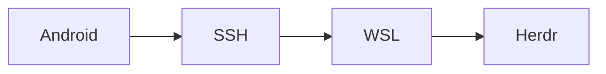

# Hexgate remote preview

A Markdown fixture with document-relative resources fetched through SSH/SFTP.

```text
한글 문서
```


```mermaid
flowchart LR
  Android --> SSH --> WSL --> Herdr
```


[Open the draw.io file](architecture.drawio)


